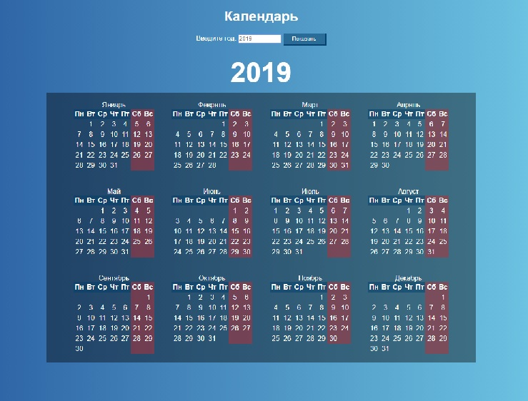

Calendar application
======

This application allows you to get a calendar for the specified year. The application is implemented in native JavaScript.
***
The following technologies were used in the development:
* HTML5
* CSS3
* SASS
* native JavaScript
* Gulp, Autoprefixer, Babel
* Git
